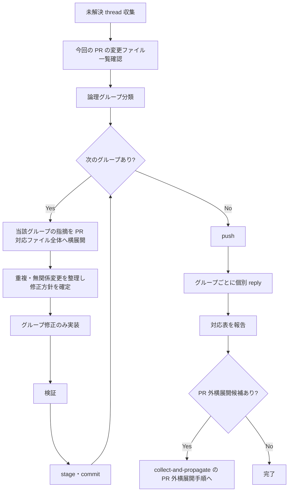

# グループごとの commit・reply 順序

## Bot 書き込み必須

GitHub への comment / reply / resolve は、bot preflight 成功後に bot helper script のみ使う。
bot 資格情報が未設定または preflight が失敗した場合は、`kf-g-github-operations-bot-workflow` の setup 手順を表示して停止する。
人間 `gh` 認証や `GH_TOKEN` への fallback は禁止。

参照:

- `kf-g-github-operations-bot-workflow` — preflight / write gate

reply:

```sh
node ~/.agents/credentials/github/scripts/github-agent-reply.mjs OWNER/REPO PR_NUMBER COMMENT_ID BODY_FILE
```

## 全体フロー



PR 外横展開の詳細は [collect-and-propagate.md](collect-and-propagate.md) を読む。

## 1 グループあたりの手順

各グループ G{n} について、次を順に実行する。

1. G{n} に割り当てた thread の指摘を、今回の PR で対応した全ファイルへ横展開する。この横展開はユーザーの許可を待たずに行い、各対象への適用結果を確認してから修正方針を確定する。
1. G{n} の変更だけを実装する。他グループの修正を混ぜない
1. lint・テスト・必要な差分確認を実行する
1. G{n} の変更ファイルだけを stage する
1. `git diff --cached --stat` と `git diff --cached --name-status` を確認する
1. 1 つの関心事だけが staged なら commit する
1. commit message は `kf-g-git-commit-japanese-commit-message` に従う
1. commit message には変更理由を書く。レビュー件数は書かない
1. commit 後、次のグループへ進む

## commit message の書き方

| 書く | 書かない |
| --- | --- |
| 何をなぜ変えたか | `レビュー指摘 7 件対応` |
| 論理変更の単位（例: `表記を横断統一`） | `Fix multiple issues` |
| 1 グループ = 1 関心事 | 無関係な変更の混在 |

## push と reply の順序

1. すべてのグループの commit が完了するまで push しない
1. `git push` で remote に反映する
1. push 前に thread へ reply しない
1. push 後、グループ G{n} ごとに次を実行する
   1. reply 前に bot preflight を成功させ、上記 bot helper script を使う
   1. bot preflight 失敗時は setup 手順を表示して停止し、人間 `gh` 認証や `GH_TOKEN` へ fallback しない
   1. G{n} に対応する thread へ個別 reply する
   1. reply 本文は変更概要から始め、続けて commit リンクを書く
   1. 説明のみ・保留の thread は reply 本文をその旨から始める
   1. resolve はユーザーが行う。エージェントは resolve しない
1. すべてのグループの個別 reply が完了したら、対応表を報告する
1. PR 外ファイルへの横展開候補がある場合は [collect-and-propagate.md](collect-and-propagate.md) の PR 外横展開手順に従う

## reply 本文の最低項目

1. 対応した変更の概要（1〜3 行）を先頭に書く
1. 対応 commit へのリンク（`[{commit message 1 行目}]({PR base URL}/changes/{commit id})`）を続けて書く
1. 説明のみ・保留の場合は、その旨と理由を先頭から書く

## reply 本文の文体

1. reply 本文は変更概要・commit リンク・説明理由から始める
1. 複数 thread を 1 つの reply にまとめない
1. 受領クッション前置きを書かない（`ご指摘ありがとうございます`、`ご質問ありがとうございます` など、必須でない受領表現はすべて禁止）
1. 挨拶・お礼・謝罪などの前置きを書かない
1. `genshijin 丁寧` のクッション言葉・過度な前置き削除と整合させる

## 同じファイルに複数グループがある場合

1. 先に G{1} だけを編集し、commit する
1. 続けて G{2} だけを編集し、commit する
1. 1 ファイル内でも、無関係な修正を同じ commit に入れない

## 委譲時の指示

orchestrator が worker へ委譲する場合、次を明示する。

- 対象グループ名と対象 thread
- 「当該グループの変更だけを 1 commit にする」
- 「他グループの変更を同じ commit に混ぜない」
- push・reply は全グループ完了後に行う（resolve はユーザーが行う）

「N ファイルを 1 commit」というファイル数基準の指示は使わない。
