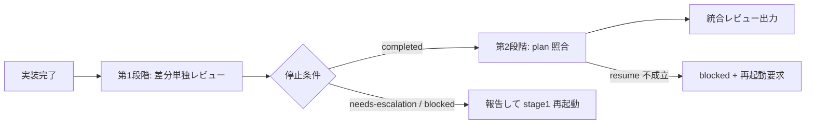

# orchestrator 向けガイド

**前提**: [SKILL.md](../SKILL.md) frontmatter `description` の対象条件を満たす場合のみ本 guide を読む。

**参照者**: orchestrator 向け詳細。reviewer worker は [stage-procedures.md](stage-procedures.md) と [review-output-format.md](review-output-format.md) を使う。

**参照開始条件**: 本 skill でレビュー worker を起動するとき、第1/第2段階の委譲指示を作るとき、レビュー結果を統合し最終チェックするとき。

## 全体フロー



1. orchestrator が第1段階 reviewer を起動（plan 非共有）
1. 第1段階完了後、**同一 reviewer** を `resume` で第2段階へ
1. 第2段階で plan を渡し、第1段階指摘を維持したまま照合

停止条件・stage1 再起動・resume 不成立: [stage-procedures.md](stage-procedures.md)。出力形式: [review-output-format.md](review-output-format.md)。

## 起動要約

**着手前**: [SKILL.md](../SKILL.md) frontmatter `description` の適用条件を確認し、対象条件を満たす場合のみ本 skill を使う。非対象では通常レビューへ。

### 第1段階委譲

```markdown
## goal
実装 diff の plan 非参照レビュー（第1段階）

## inputs
- diff: branch changes
- scope: <paths>
- stage1 入力: diff / scope / 委譲指示のみ（plan / issue plan 節 / acceptance は stage2 入力）

## constraints
- stage1 入力を diff・実行結果・テスト等に限定し、plan は stage2 入力として追加する
- plan 依存の疑いは plan-dependent として記録し、第2段階で disposition を付ける
- 品質観点（設計妥当性・代替案・不要複雑さ・実質影響）は plan-independent として記録する
- 出力: references/review-output-format.md の第1段階形式
```

### 第2段階委譲（**同一 subagent を resume**）

```markdown
## goal
第1段階指摘を維持した plan 照合レビュー（第2段階）

## inputs
- 第1段階出力（添付）
- plan: <path or text>
- diff: branch changes

## constraints
- 第1段階が `completed` のときのみ第2段階委譲を作成する
- stage1 出力全文を stage2 へそのまま引き継ぎ、disposition と根拠を追加する
- 各指摘で plan 整合判定と品質妥当性判定を独立実施する（二軸判定）
- stage1 タグ（plan-independent / plan-dependent）に依存せず、品質妥当性を再判定する
- plan 整合かつ品質問題あり → `plan-aligned-quality-issue`。stage1 severity と指摘本文を維持する
- plan-dependent 指摘で品質問題が残る場合も `plan-aligned-quality-issue`。stage1 severity と指摘本文を維持する
- `plan-dependent-resolved` は plan 整合（要件充足・意図一致）かつ品質妥当性が `n/a` または `resolved` の場合のみ付与する
- plan-independent 指摘の disposition 変更は `factually-incorrect` のみ。根拠付きの事実誤り確認と notes 記載が必須
- `factually-incorrect` は severity を `n/a` とし、merge blocker カウント対象外とする
- 同一 reviewer を resume で継続し、resume 成立を stage2 開始条件にする
- 出力: references/review-output-format.md の第2段階形式
```

## 最終チェック

- [ ] 適用判定の対象（プログラミング設計・実装）であるか。対象条件を満たす場合のみ本 skill を使っているか
- [ ] 第1段階 reviewer 入力が diff / scope / 委譲指示に限定されているか
- [ ] 第2段階は同一 subagent の resume か
- [ ] 第1段階指摘が第2段階出力にすべて残っているか
- [ ] 各指摘に plan 整合判定と品質妥当性判定が独立記録されているか
- [ ] plan-independent 指摘で disposition を変更する場合、`factually-incorrect` と根拠付きの事実誤り確認（location・挙動・影響）が notes に記録されているか
- [ ] plan-independent 指摘を維持する場合、品質根拠（保守性・安全性・性能・複雑さ）が記録されているか
- [ ] plan 通りの過剰設計・複雑さを `plan-aligned-quality-issue` として severity 維持で残しているか
- [ ] `blockers: <count>` が stage2 最終 disposition / 最終 severity に基づいて算出されているか。集計対象 disposition（`confirmed` / `context-added` / `plan-mismatch-escalated` / `plan-aligned-quality-issue`）かつ最終 severity が `blocker` の行のみを数え、除外 disposition（`factually-incorrect` / `plan-dependent-resolved`）を含めていないか。stage1 severity 列ではなく stage2 最終値を集計しているか
- [ ] merge recommendation が品質 blocker（`plan-aligned-quality-issue` 含む）を反映しているか
- [ ] plan-dependent タグの指摘で品質次元を含む場合、品質妥当性を再判定し `plan-aligned-quality-issue` で severity を維持しているか
- [ ] plan-dependent 指摘が第2段階で disposition 付きで処理されているか
- [ ] `plan-dependent-resolved` は plan 整合（要件充足・意図一致）かつ品質妥当性が `n/a` または `resolved` の場合のみ付与されているか
- [ ] 停止条件（blocked / needs-escalation）が明記されているか
- [ ] 第1段階が `completed` のときのみ第2段階を開始したか
- [ ] resume 不成立時は blocked として報告し、同一 reviewer 再起動を要求しているか
