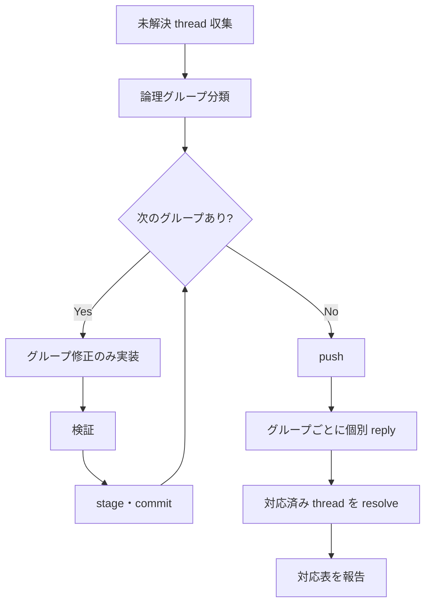

# グループごとの commit・reply 順序

## 全体フロー

## 1 グループあたりの手順

各グループ Gn について、次を順に実行する。

1. Gn に割り当てた thread だけを参照し、修正方針を確定する
1. Gn の変更だけを実装する。他グループの修正を混ぜない
1. lint・テスト・必要な差分確認を実行する
1. Gn の変更ファイルだけを stage する
1. `git diff --cached --stat` と `git diff --cached --name-status` を確認する
1. 1 つの関心事だけが staged なら commit する
1. commit message は `kf-g-git-commit-japanese-commit-message` に従う
1. commit message には変更理由を書く。レビュー件数は書かない

## commit message の書き方

| 書く | 書かない |
| --- | --- |
| 何をなぜ変えたか | `レビュー指摘 7 件対応` |
| 論理変更の単位（例: `v{N} 表記を横断統一`） | `Fix multiple issues` |
| 1 グループ = 1 関心事 | 無関係な変更の混在 |

## push と reply の順序

1. すべてのグループの commit が完了するまで push しない
1. `git push` で remote に反映する
1. push 後、グループ Gn ごとに次を実行する
   1. Gn に対応する thread へ個別 reply する
   1. reply に commit short hash と変更概要を含める
   1. 修正完了した thread を resolve する

## reply 本文の最低項目

- 対応した変更の概要（1〜3 行）
- 対応 commit へのリンク（`[{short hash}]({PR base URL}/changes/{commit id})`）
- 説明のみ・保留の場合はその理由

## 同じファイルに複数グループがある場合

1. 先に G1 だけを編集し、commit する
1. 続けて G2 だけを編集し、commit する
1. 1 ファイル内でも、無関係な修正を同じ commit に入れない

## 委譲時の指示

orchestrator が worker へ委譲する場合、次を明示する。

- 対象グループ名と対象 thread
- 「当該グループの変更だけを 1 commit にする」
- 「他グループの変更を同じ commit に混ぜない」
- push・reply・resolve は全グループ完了後に行う

「N ファイルを 1 commit」というファイル数基準の指示は使わない。
